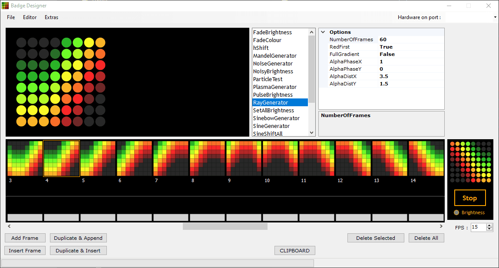

Badge Project (~2012)
======

The precursor to final Oddity hardware, the *Badge* was a chunky 8x8 LED display mated with a MAX6960 display driver powerful enough to playback canned sequences from onboard memory. My pal John Popadic (https://johnpopadic.wordpress.com/) was the master behind the circuit design; a snapshot of his files from this time are under `/hardware`, more are available from his own site/Tumblr for the curious.

To design pretty patterns for it, I built a little authoring and upload tool `Badge Designer` in C# / WinForms; this is under the `/toolchain` folder. The aborted refactor is in `/toolchain2` - we had already moved on to running patterns live on device before I finished it.

BD served as a 8x8 or 16x16 3-bit RG paint tool, a pluggable and scriptable pattern generator, a basic animation sequencer, previewer and a portal for pushing the resulting data over a serial port to the Badge hardware. 
