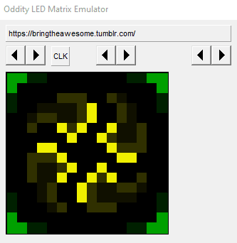
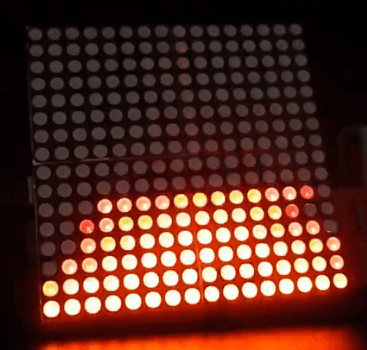

Oddity
======

This contains both the source for the Oddity software that can be built and pushed to the hardware (in `/Core`) and a Win32 'Emulator' that allows us to test and iterate patterns for the display without flashing the hardware each time.

It compiles the same base code with a basic GUI skeleton that shows a LED display preview and simulates the 3 input dials on the top of the actual hardware.

Building and communicating with the hardware relies on LeafLabs' MapleIDE (try [here](http://docs.leaflabs.com/static.leaflabs.com/pub/leaflabs/maple-docs/latest/maple-ide-install.html) or [perhaps this](https://github.com/leaflabs/maple-ide))

.. and an Oddity board, obviously. Which likely you don't have. Sorry.