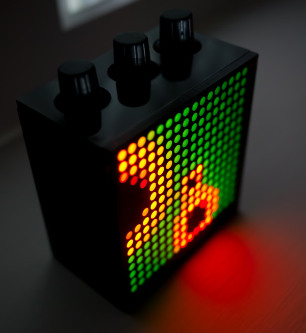

# Oddity

An archive of experiments, tools and snapshots from the "Oddity" art project; A small black box full of bright LEDs that twinkle and swirl, producing hypnotic procedural patterns.

It was a collaboration between myself and [John Popadic](https://johnpopadic.wordpress.com/) sporadically between ~2008-2013 that ended up being exhibted at the [Kinetica Art Fair](http://www.kinetica-artfair.com/?exhibitors/2013/john-popadic).

Further history and reflections on the project can be found at https://www.ishani.org/projects/Oddity/ and https://johnpopadic.wordpress.com/oddity/

The repository contains

 * Badge - an early prototype / initial experiment that kicked off our interest; offline pattern generation
 * Oddity - the final code used during exibition; realtime pattern generation
 * Oddity2 - some (abandoned) refactoring of the above
